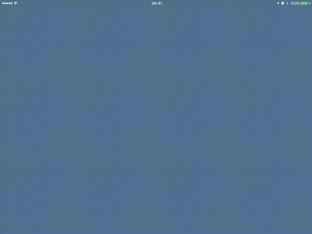

# Polar Clock
A polar clock for iOS written in Swift.

## Description
The rings represent the components of the current time.

Color | Component
--- | ---  
Yellow | Second
Orange | Minute
Pink | Hour
Green | Day
Blue | Month
Purple | Year

## Animation
- When the clock is first displayed the rings fade in and expand to their initial positions
- The rings animate to their positions as time progresses

## Demo

## Dependencies

I used the following libraries for this project:

1. [`AsyncSwift`](http://github.com/duemunk/Async) - Asynchronous dispatches in Grand Central Dispatch
2. [`SwiftDate`](http://github.com/malcommac/SwiftDate) - Date and time components
3. [`AutoLayoutBuilder`](http://github.com/marcbaldwin/AutoLayoutBuilder) - Layout Constraints
